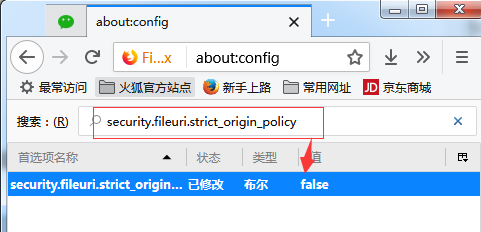
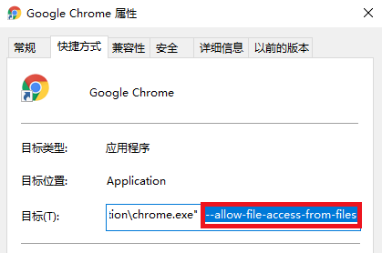

# 十种实现跨域的方式

## 1.降级浏览器

### ie 浏览器：

* 安全设置中将跨域浏览窗口和框架选择启用

  

### 火狐浏览器：

* 1.地址栏中输入 about:config,然后单击“我了解此风险”

* 2.找到 security.fileuri.strict_origin_policy,然后在值下面的 true 右键单击，选择切换，修改其参数：true 改为 false

* 3.重启浏览器

### 谷歌中加入：

#### 方法一

* 谷歌浏览器快捷方式中，属性-目标-在'C:\Program Files(x86)\Google\Chrome\Application\chrome.exe'后面加 --allow-file-access-from-files。然后先点击“应用按钮”，再点击“确定按钮”，重启谷歌浏览器，跨域问题解决！

#### 方法二（新版谷歌浏览器）

* --user- data- dir=C:\MyChromeDevUserData

* c 盘中建立文件夹：MyChromeDevUserData

## 2.cors

* 服务端建立白名单允许某些域名跨域

## 3.nginx

* 服务器之间不跨越，代理服务器

## 4.http- proxy

* 服务器 3000 端口：http://localhost:3000 数据 ok

* http- proxy 代理 4000 端口：http://localhost:4000 数据 ok

## 5.jsonp

* 利用 script 允许跨域的特征

## 6.domain

* 二级域名之间跨域，子域名指定其一级域名

* frame.contentWindow 中有传过来的值

## 7.name

* a、b 页面同源

* a、c 页面跨域

* a：a 页面有 c 页面,a 中替换 c 页面为 b 页面

* c:传值

* a：iframe.contentWindow 中有传过来的值

## 8.hash

* a、b 页面同源

* a、c 页面跨域

* a：a 页面有 c 页面

* c:创建 b 页面并传值

* b:window.parent.parent.location.hash = location.hash

* a:得到 c 中的 b 传过来的值

## 9.postMessage

* 相当于代理服务器

* a:frame.contentWindow.postMessage 传数据；window.onmessage 接数据

* b:window.onmessage 接数据；e.source.postMessage 传数据

## 10.websocket

* a：a 页面http://localhost:4000/a.html

* websocket 服务器 3000 端口两者之间可以通信
